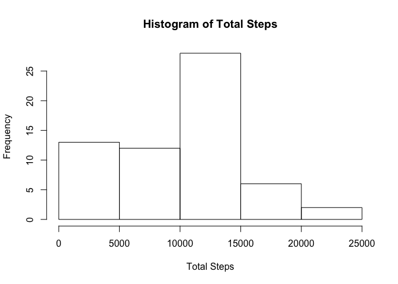
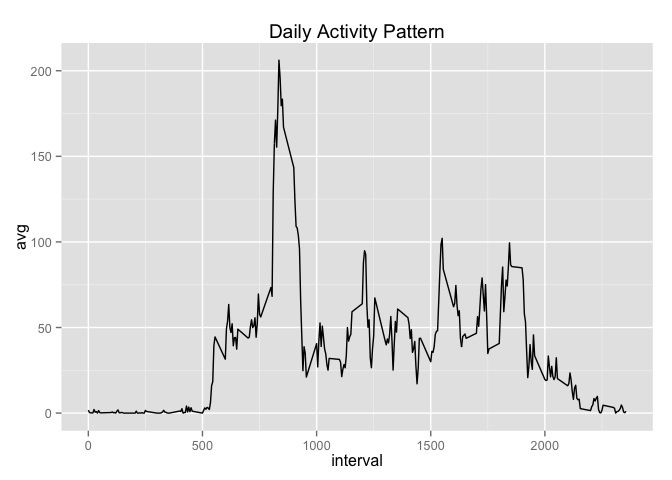
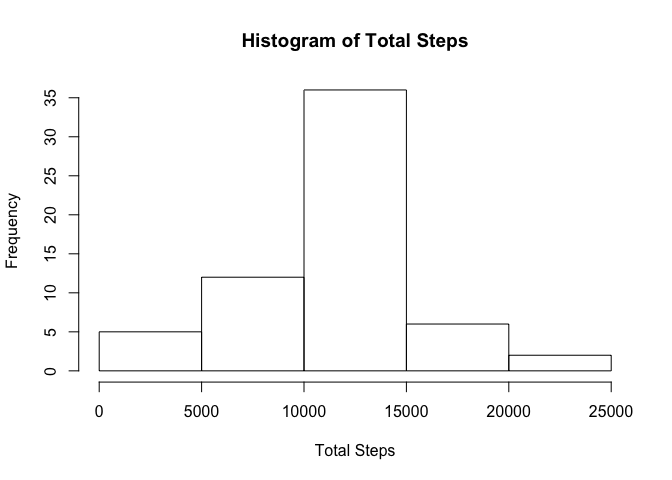
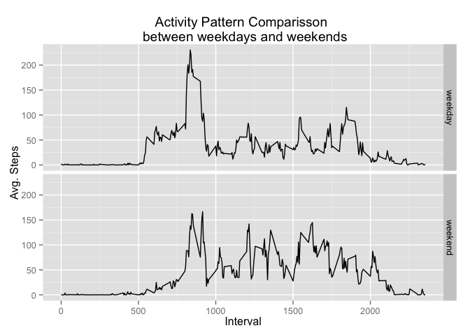

# Reproducible Research: Peer Assessment 1

## Loading and preprocessing the data

```r
library(dplyr)
library(ggplot2)
data <- read.csv('activity.csv')
totalsteps <- data %>% group_by(date) %>% summarise(total = sum(steps, na.rm=TRUE))
timegroup <- data %>% group_by(interval) %>% summarise(avg = mean(steps, na.rm=TRUE))
```

## What is mean total number of steps taken per day?

```r
totalsteps
```

```
## Source: local data frame [61 x 2]
## 
##          date total
## 1  2012-10-01     0
## 2  2012-10-02   126
## 3  2012-10-03 11352
## 4  2012-10-04 12116
## 5  2012-10-05 13294
## 6  2012-10-06 15420
## 7  2012-10-07 11015
## 8  2012-10-08     0
## 9  2012-10-09 12811
## 10 2012-10-10  9900
## ..        ...   ...
```

```r
hist(totalsteps$total, main = "Histogram of Total Steps", xlab="Total Steps")
```

 

```r
summarise(data, mean = mean(steps, na.rm=TRUE), median = median(steps, na.rm=TRUE))
```

```
##      mean median
## 1 37.3826      0
```


## What is the average daily activity pattern?

```r
qplot(x=interval, y=avg, data=timegroup, geom="line", main="Daily Activity Pattern")
```

 

The maximum number of average steps occurs in the 835 time interval

```r
timegroup[timegroup$avg == max(timegroup$avg), ]
```

```
## Source: local data frame [1 x 2]
## 
##   interval      avg
## 1      835 206.1698
```


## Imputing missing values
1. The total number of missing step values is 2304

```r
sum(is.na(data$steps))
```

```
## [1] 2304
```

2. I decided to fill in the NA values with the mean steps taken in the corresponding 5-minute interval

3. Creating a new dataset 'datafilled' with replaced values for NA

```r
# Create a set with just the NA records
missingsteps <- data[is.na(data$steps),]

# Create a set with complete records
withsteps <- data[complete.cases(data),]

# Create a set with replaced NA values from the timegroup average steps 
fillsteps <- missingsteps %>% merge(select(timegroup, interval, avg)) %>% select(steps = avg, date, interval) %>% arrange(date, interval)

# Combine two subsets to create final with replaced NA values
datafilled <- rbind(withsteps, fillsteps)
```

4. Although the mean/median did not change by replacing the NA values with average for the time
interval, the distribution on the histogram is less skewed.

```r
totalsteps2 <- datafilled %>% group_by(date) %>% summarise(total = sum(steps))
hist(totalsteps2$total, main = "Histogram of Total Steps", xlab="Total Steps")
```

 

```r
summarise(datafilled, mean = mean(steps), median = median(steps))
```

```
##      mean median
## 1 37.3826      0
```

## Are there differences in activity patterns between weekdays and weekends?

```r
data2 <- mutate(datafilled, day = weekdays(as.Date(date)),
                partofweek = ifelse(day %in% c("Saturday", "Sunday"), "weekend", "weekday"))

timegroup2 <- data2 %>% group_by(partofweek,interval) %>% summarise(avg = mean(steps))

g <- ggplot(data=timegroup2, aes(interval, avg))
g + geom_line() + facet_grid(partofweek~.) + xlab("Interval") + ylab("Avg. Steps") + ggtitle("Activity Pattern Comparisson \n between weekdays and weekends")
```

 

